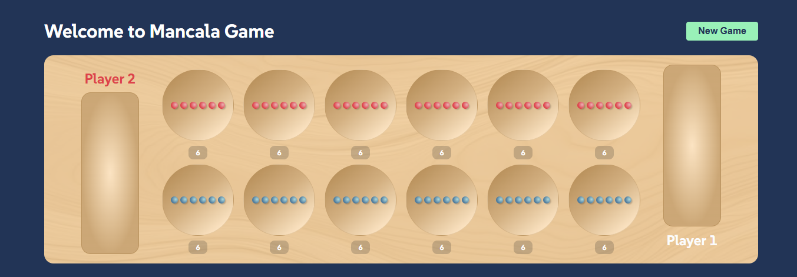
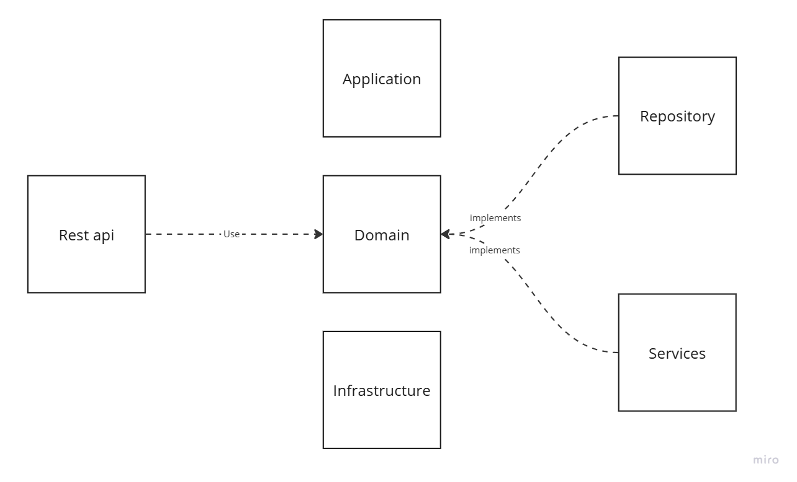

# Mancala Game 

## Overview

This project demonstrates the integration of an Angular frontend with a Spring Boot API, which uses an in-memory Redis database to store game data. It allows users to play the Mancala/Kalah game. The application includes the following features:

- Start a new game
- Sow seeds



## *Technologies Used*
### Frontend
- Angular: For creating a dynamic and responsive user interface.

### Backend
- Kotlin and Spring Boot: For managing the game logic and RESTful APIs.

### Database
- Redis: An in-memory database used to store game state data temporarily for fast access.

### Features
- Start a Game: Users can create a new game session.

- Stones: Functionality to move stones around the board based on the game rules.

## Architectural choices
Hexagonal architecture was used in this project to separate the concerns of the application into different layers. This architecture allows the application to be more modular and flexible, making it easier to maintain and test.



## How to Run the Project
### Pre requisites

- Node.js and npm: Required to run the Angular frontend.
- Java 17+: Required to run the backend with kotlin and Spring Boot.
- Redis: An in-memory database needed to store the game data.
- Docker: Required for containerizing the application components, making it easier to manage dependencies and deploy the application in different environments.

## Steps to Run
### Frontend (Angular)
1. Navigate to the frontend directory

Code:```cd mancala-web```

2. Install the dependencies

Code: ```npm install``` 

3. Start the development server

Code: ```ng serve```

4. Open the app in your browser: http://localhost:4200/

### Backend (Spring Boot)

1. Navigate to the backend directory

```cd mancala-api```

2. Run redis image in docker

```docker-compose up -d```

3. Navigate to the main module directory

```cd mancala```

4. Clean and install all dependencies

```./mvn clean install```

5. Run The application

```./mvn spring-boot:run```

6. The API will be available at http://localhost:8080/

### Redis

- Ensure Redis is running locally or in your cloud environment for the game data to be stored.

## Testing

### Frontend

- To run the unit tests for the Angular frontend:

Code: ```ng test```

### Backend

- To run the tests for the Spring Boot backend:

Code: ```./mvn clean test```

## Next steps
- Add WebSockets to enable real-time updates for the game and being able to play with other users that are not in the same computer
- Add animation for the stones to get added one by one to each pit when the user clicks on a pit.